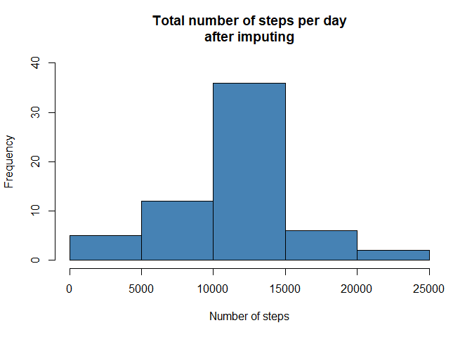
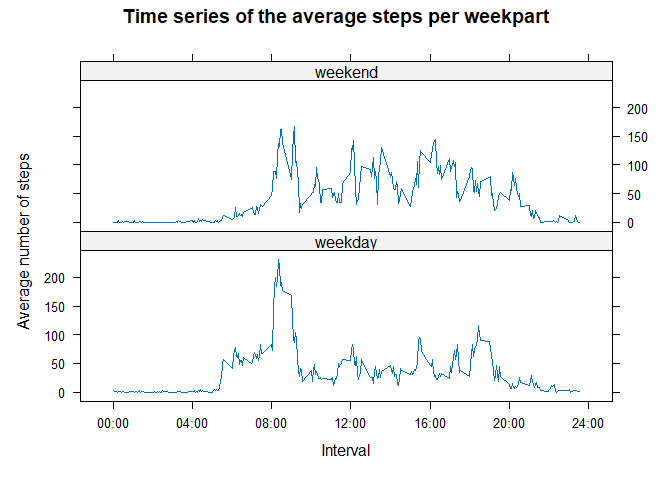

## Loading and preprocessing the data {#preprocess}

First of all, we download and unzip the data, in case the data set is not 
already available in the working directory.


```r
if (!file.exists("activity.zip")) {
        urlData <- "https://d396qusza40orc.cloudfront.net/repdata%2Fdata%2Factivity.zip";
        download.file(url = urlData, destfile = "activity.zip");
}

if (!file.exists("activity.csv")) {
        unzip("activity.zip")
}
```

Then, before loading the whole data set with `read.csv()`, we give a quick look at its heading:


```r
read.csv("activity.csv", nrows=14)
```

```
##    steps       date interval
## 1     NA 2012-10-01        0
## 2     NA 2012-10-01        5
## 3     NA 2012-10-01       10
## 4     NA 2012-10-01       15
## 5     NA 2012-10-01       20
## 6     NA 2012-10-01       25
## 7     NA 2012-10-01       30
## 8     NA 2012-10-01       35
## 9     NA 2012-10-01       40
## 10    NA 2012-10-01       45
## 11    NA 2012-10-01       50
## 12    NA 2012-10-01       55
## 13    NA 2012-10-01      100
## 14    NA 2012-10-01      105
```

We observe that :

- the columns have headings;
- the first column, "steps", comes from a counting variable, hence shall contain only integers;
- the second column, "date", shall contain the dates of the measurements in the format YYYY-MM-DD;
- the third column, "interval", shall contain the identifier for the 5-minute interval in which measurement was taken, which is an integer between 0 and 2400 of the form hhmm.

Therefore, we can specify a few arguments to make the procedure faster:


```r
rawData <- read.csv("activity.csv",
                    header = TRUE,
                    colClasses = c("numeric", "character", "numeric"))
summary(rawData)
```

```
##      steps            date              interval     
##  Min.   :  0.00   Length:17568       Min.   :   0.0  
##  1st Qu.:  0.00   Class :character   1st Qu.: 588.8  
##  Median :  0.00   Mode  :character   Median :1177.5  
##  Mean   : 37.38                      Mean   :1177.5  
##  3rd Qu.: 12.00                      3rd Qu.:1766.2  
##  Max.   :806.00                      Max.   :2355.0  
##  NA's   :2304
```

Our initial observations are confirmed by:


```r
identical(rawData$steps, as.numeric(as.integer(rawData$steps))) # TRUE
identical(rawData$interval, as.numeric(as.integer(rawData$interval))) # TRUE
```

Therefore, we can convert the columns into a more convenient format:


```r
rawData$steps <- as.integer(rawData$steps)
rawData$date <- as.Date(rawData$date, format = "%Y-%m-%d")
rawData$interval <- as.integer(rawData$interval)
```

Recall that the summary tells that we have 2304 NA under the "steps" variable.  That is to say:  


```r
sum(is.na(rawData$steps))/nrow(rawData)
```

```
## [1] 0.1311475
```

around 13% of the total observations.

A second look at the data leads to conjecture that NAs are concentrated in days without observations. Let us check:


```r
byDay <- aggregate(steps ~ date, 
                   data = rawData, 
                   FUN = function(X) { sum(is.na(X)) }, 
                   na.action = na.pass)
names(byDay) <- c("date","NAs")
byDay[byDay$NAs != 0,]
```

```
##          date NAs
## 1  2012-10-01 288
## 8  2012-10-08 288
## 32 2012-11-01 288
## 35 2012-11-04 288
## 40 2012-11-09 288
## 41 2012-11-10 288
## 45 2012-11-14 288
## 61 2012-11-30 288
```

The conjecture was true. Moreover, we conclude that there are 8 days without observations:


```r
sum(byDay$NAs != 0)
```

```
## [1] 8
```


For the moment, we ignore them and we promote "rawData" to our tidy "data" set:


```r
data <- rawData
```

Now, we are ready to begin our analysis.

## What is mean total number of steps taken per day?

We start by calculating the total number of steps taken per day and I choose to keep track of the NAs:


```r
daySteps <- aggregate(steps ~ date, 
                      data = data, 
                      sum, 
                      na.action = na.pass)
```

Then, we plot an histogram of the result:


```r
# the ylim parameter is settled in order to make the histogram easily comparable with the one after imputing
hist(daySteps$steps,
     main = "Total number of steps per day",
     xlab = "Number of steps",
     ylim = c(0,40),
     col = "Steelblue")
```

<!-- -->

from which we can already guess that the mean and median of the total number of steps are going to lay between 10000 and 15000. The result is confirmed by:


```r
mean(daySteps$steps, na.rm = TRUE)
```

```
## [1] 10766.19
```

```r
median(daySteps$steps, na.rm = TRUE)
```

```
## [1] 10765
```

## What is the average daily activity pattern?

In order to analyse the average daily activity pattern, we first compute the average number of steps per 5-minute interval, this time omitting the NAs:


```r
intervalSteps <- aggregate(steps ~ interval, 
                           data = data, 
                           mean, 
                           na.action = na.omit)
```

and we make a time series plot of the result:


```r
with(intervalSteps,
     plot(interval, steps,
          type = "l",
          xlab = "",
          ylab = "",
          xaxt = "n"))
axis(side = 1,
     at = seq(0,2400,length.out = 7),
     labels = c("00:00", "04:00", "08:00", "12:00", "16:00", "20:00", "24:00"))
title(main = "Time series of the average steps per 5-minute interval",
      xlab = "Time",
      ylab = "Average number of steps")
```

<!-- -->

We immediately notice that there is a peak in the activity around 8am. To find the exact interval, we introduce a function to convert the identifier of the interval into a human readable time


```r
int_to_time <- function(X) {
        # takes an integer hhmm between 0 and 2400 and converts it into "hh:mm"
        hh <- as.integer(X/100)
        mm <- X-as.integer(X/100)*100
        if (mm %in% 0:9) {
                return(paste(hh,":0", mm, sep = ""));
        }
        else if (mm %in% 10:59) {
                return(paste(hh,":", mm, sep = ""));
        }
        else print("Input is not an integer between 0 and 2400")
}
```

then we compute the index of the maximum and so the interval of time:


```r
i_max <- which.max(intervalSteps$steps)
cat(int_to_time(intervalSteps$interval[i_max]),
    "-",
    int_to_time(intervalSteps$interval[i_max+1]),
    sep = " ")
```

```
## 8:35 - 8:40
```

## Imputing missing values

Now it is time to deal with the missing values. There are


```r
sum(is.na(data$steps))
```

```
## [1] 2304
```

missing values, distributed as we observed in [the first section](#preprocess). In view of what we observed there, to fill in the NAs I can impute the missing data by using the average of the ones from the same interval in the other days, taking advantage fo the fact that R recycles vectors: each chunk of missing data consists of 288 missing measurements, that I can fill in with the 288 means in "intervalSteps".
Even if this breaks the coherence, I do not truncate the average to obtain an integer.


```r
imputed_data <- data
imputed_data[is.na(data$steps),"steps"] <- intervalSteps$steps
```

To see the impact of imputing missing data on our estimates, let us plot the histogram of the total number of steps per day again:


```r
# this time I decide to use dplyr, for the sake of elegance
library(dplyr)

imputed_daySteps <- imputed_data %>%
        as_tibble %>%
        group_by(date) %>%
        summarise(steps = sum(steps))

hist(imputed_daySteps$steps,
     main = "Total number of steps per day\nafter imputing",
     xlab = "Number of steps",
     ylim = c(0,40),
     col = "Steelblue")
```

<!-- -->

and we may compare it with our first histogram: the peak is 8 points higher. As we expect, the mean does not change (this can be checked directly with a few algebraic manipulations) while the median does and becomes equal to the mean.


```r
# the mean does not change (this is math), while the median does
mean(imputed_daySteps$steps)
```

```
## [1] 10766.19
```

```r
median(imputed_daySteps$steps)
```

```
## [1] 10766.19
```

## Are there differences in activity patterns between weekdays and weekends?

Let us add a factor variable "weekpart" to our imputed data set, to keep track of whether the data come from a weekday or not:


```r
weekend <- c("Saturday", "Sunday")
imputed_data$weekpart <- as.factor(
        if_else(weekdays(imputed_data$date) %in% weekend,
                "weekend",
                "weekday")
        )
```

Then, let us plot again the time series, but now separated between weekdays and weekends.


```r
# for the sake of elegance, I will use the lattice package
library(lattice)
library(dplyr)

weekpartSteps <- imputed_data %>%
        group_by(weekpart,interval) %>%
        summarise(steps = mean(steps))

xyplot(steps ~ interval | weekpart, 
       data = weekpartSteps, 
       type = "l", 
       layout = c(1,2),
       main = "Time series of the average steps per weekpart",
       xlab = "Interval",
       ylab = "Average number of steps",
       scales = list(x = list(at = seq(0,2400,length.out = 7),
                              labels = c("00:00", "04:00", "08:00", "12:00", 
                                         "16:00", "20:00", "24:00")
                              )
                     )
       )
```

<!-- -->

Thus we can conclude that there is a difference in activity patterns between weekdays and weekends: weekdays begin earlier and are more sedentary than weekends.
